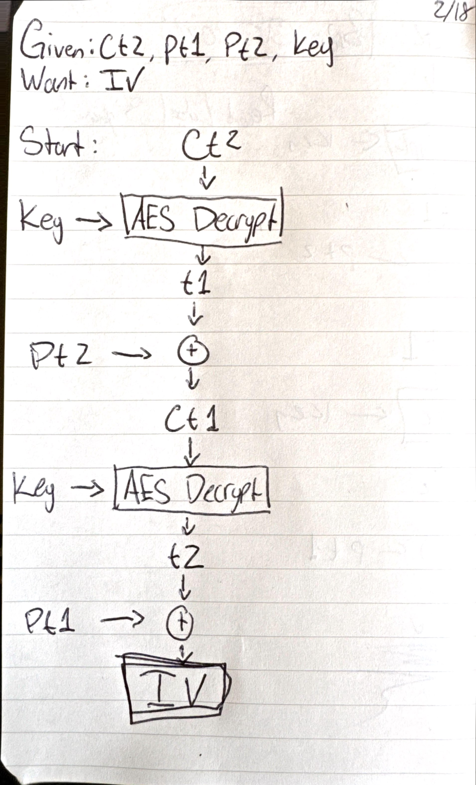

# Solution
### Writeup Author: [Casey Bates](https://github.com/cbates8)

> When using AES in CBC mode, Danny has a habit of leaving messages in his initialization vectors. Can you find his secret message?
>
> Flag Format: Wrap the IV in bronco{ }
> 
>```
> key = 73757065725f6b65795f73747265616d
> pt1 = 4163636f7264696e6720746f20616c6c
> pt2 = 206b6e6f776e206c617773206f662061
> ct2 = 817ed4df4521cc2d6e746c45a834aa2d
>```

For this challenge, we need to reverse AES encryption using the given values in order to find the IV. To do that we need to understand AES decription in CBC mode. CBC (Cipher Block Chaining) does exacly what its name describes: To encrypt, each block of ciphertext is XORed with the next plain text before it is run through AES encryption. So to do decryption, we must reverse that process.  


Before we begin creating a solution, we need to recall a few important properties of XOR.
1. Anything XORed with 0 will return itself. For example: A xor 0 = A.
2. XOR is reversible. For example: If A xor B = C, then B xor C = A.
3. XOR is commutative, it doesn't matter what order the operations occur. For example: A xor B = B xor A.

Now we can start building our solution. The first missing piece is `ct1` - since it was not given, we need to derrive it ourselves. We know from the diagram above that `pt2 = ct1 xor t1`, where `t1` is the output we recieve from decrypting `ct2` using the given `key`. Therefore we know that `ct1 = pt2 xor t1`.

Now that we have `ct1`, finding the `IV` is as simple as reapeating the above step with `ct1` and `pt1`. Again, we know from the diagram that `pt1 = IV xor t2`, where `t2` is the output from decrypting `ct1` using `key`. Thus, `IV = pt1 xor t2`.

The following diagram shows the process from start to finish.




One thing to note before writing any code: Most CBC mode implementations of AES require you to provide an `IV`, but in this case that is what we are trying to find. We can get around this restriction by providing a string of `0` the same length as our `key` and ciphertexts. Recalling the XOR property #1 above, we know that any time this temp `IV` is XORed with anything, it will not have an effect.

The following is a simple program that will print out the `IV`, as well as the other values we calculate along the way so we can check our work.

```python
from binascii import hexlify, unhexlify
from Crypto.Cipher import AES

KEY = "73757065725f6b65795f73747265616d"
TMP_IV = "00000000000000000000000000000000"
PT1 = "4163636f7264696e6720746f20616c6c"
PT2 = "206b6e6f776e206c617773206f662061"
CT2 = "817ed4df4521cc2d6e746c45a834aa2d"


def aesDecrypt(msg):
	""""Decrypts a given message"""
    # Create aes cipher in cbc mode
    # Need to use our own IV, otherwise a random one will be generated 
	aes = AES.new(unhexlify(KEY), AES.MODE_CBC, unhexlify(TMP_IV)) 

	ct= unhexlify(msg)
	pt = aes.decrypt(ct)
	return pt


def bxor(ba1, ba2):
    """XOR two byte strings"""
    return bytes([_a ^ _b for _a, _b in zip(ba1, ba2)])


if __name__ == '__main__':
    t1 = aesDecrypt(CT2)
    print(f"t1 = {t1}")
    
    ct1 = bxor(t1, unhexlify(PT2))
    print(f"ct1 = {ct1}")
    
    t2 = aesDecrypt(hexlify(ct1).decode())
    print(f"t2 = {t2}")
    
    iv = bxor(t2, unhexlify(PT1))
    print(f"iv = {iv}")     
```

This program will return `iv = b'd0nt_l3@k_ur_k3y'`, making the flag `bronco{d0nt_l3@k_ur_k3y}`