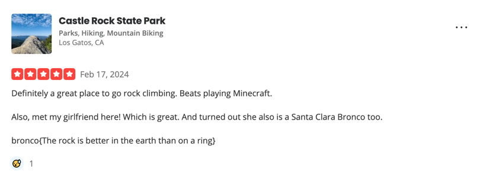

# Solution

This is a layered OSINT challenge that is purposefully long. Good luck and have fun. 

The first clue from the description is a GitHub username. This can be found through the resources in [the OSINT framework](osintframework.com). It leads [to this GitHub account](https://github.com/cupid-is-upset)

With that username, go and explore their page collecting 12 clues, which make up a URL cut into pieces. [Here](https://puzzel.org/jigsaw/play?p=-NqoEdz0zSAgBITnTa_Z)

Then, you have two options: either complete the puzzle (tedious) or just use one of many ways to grab the original image. I found the easiest to be reloading the site and grabbing the [image link in the network traffic](https://cdn.puzzel.org/uploads/uploads/o4wyjrq24elspa4giq.jpg)

The puzzle formed a QR code. This QR code leads you to a [Google Drive folder](https://drive.google.com/drive/folders/102HhjyB4NQ__0HfIVrknPEw4orxgN_NL?usp=drive_link) 

The Google Drive has a hint built in within it. If you click the info and read the Google Drive description of the Audacity file, you see the following message: ```gordan told me its raw :( i hope he doesn't get mono. 44100 ```

The name of the file is also a hint leading toward "Unsigned". Opening the file in audacity, it is just static. If you go to export, and select "RAW", "44100", "Mono", and "Unsigned", it exports an image of two characters in Minecraft. 

One of these characters has their username showing, and it is `rosbean`. Using a bit of OSINT, you can find them on [NameMC](https://namemc.com/profile/rosbean.1)

They have an [Instagram profile](https://www.instagram.com/altgirlie123) linked in their NameMC account.

The linked instagram is named alt girlie, which is a hint to look at the the alt text in the images. The locations of the posts ("Castle De haar" and "The Rock Hazelwood") are hints for the next step. The alt text on each post are as follows: `https://connections.swellgarfo.com/ga is the first half` and `me/-NqoQxFYLQxdTj6AYPL2 is the second half`

This together is a link to [a custom version of NYT Connections](https://connections.swellgarfo.com/game/-NqoQxFYLQxdTj6AYPL2). Playing it, reveals the categories "CHECK" "REVIEWS" "YELP" "CALIFORNIA STATE PARKS". 

Of the California State Parks that are options in the game, one is "Castle Rock" which matches the hints from the previous locations in the Instagram. 

Going to the [Yelp page](https://www.yelp.com/biz/castle-rock-state-park-los-gatos), you can find the review by searching or looking at the newest review (at time of the challenge). The review is now hidden under "not recommended reviews" but still viewable after searching for "bronco".



